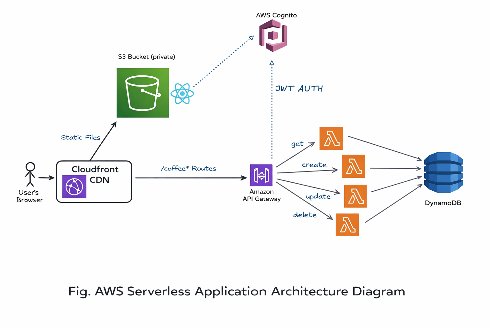
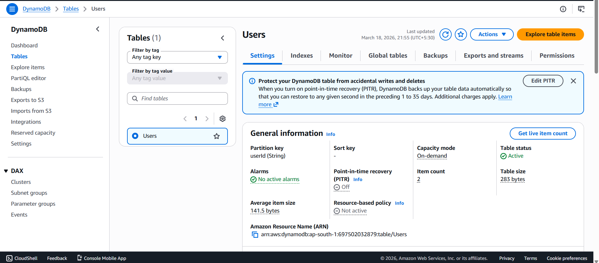
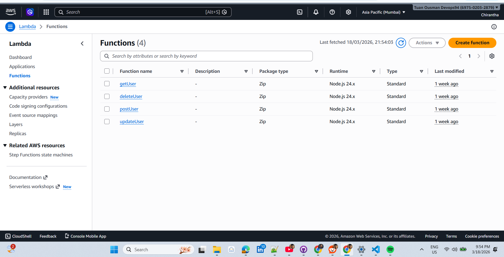
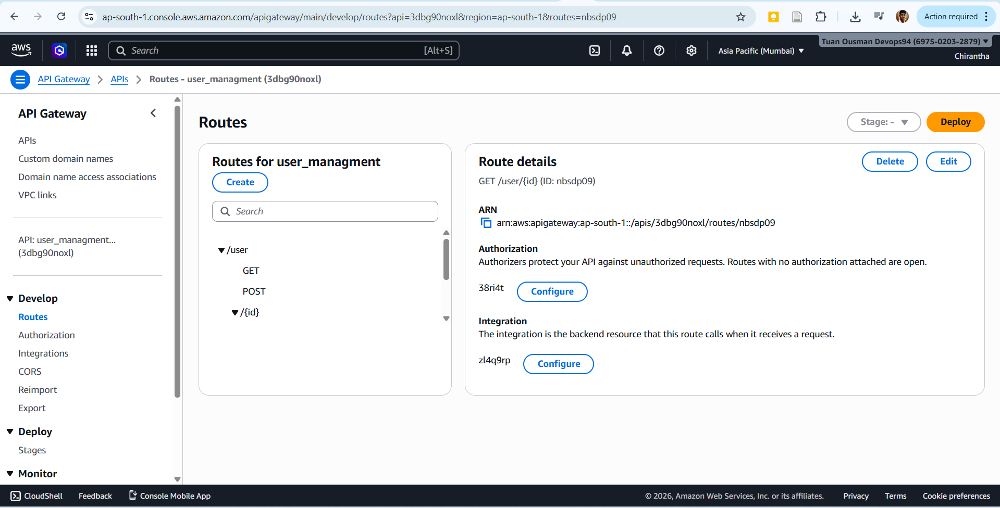
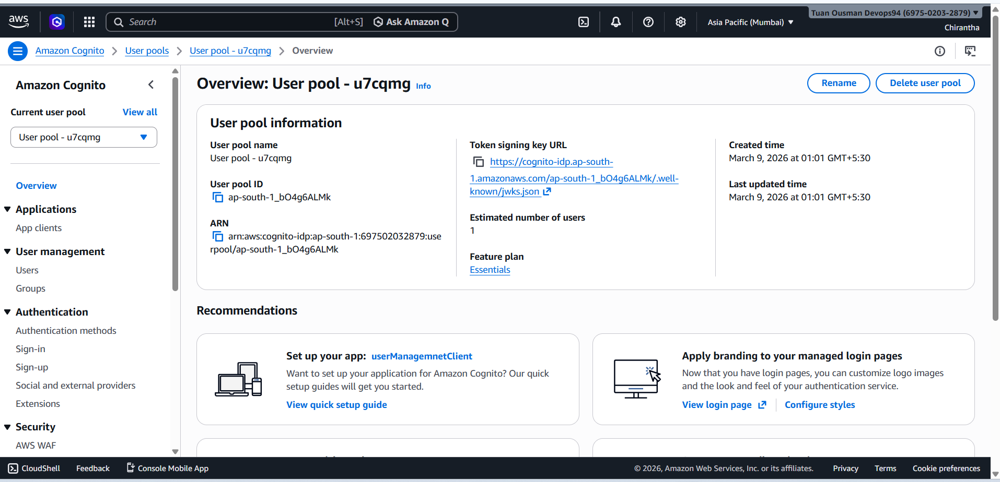
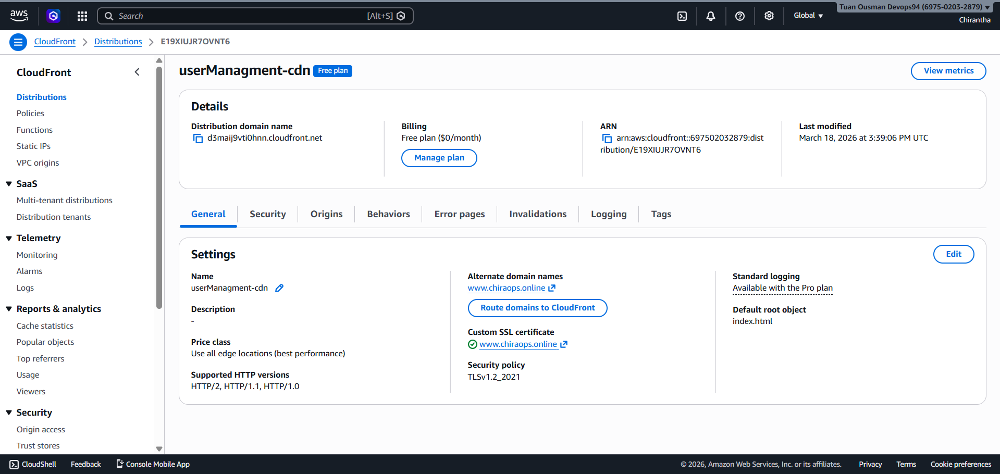
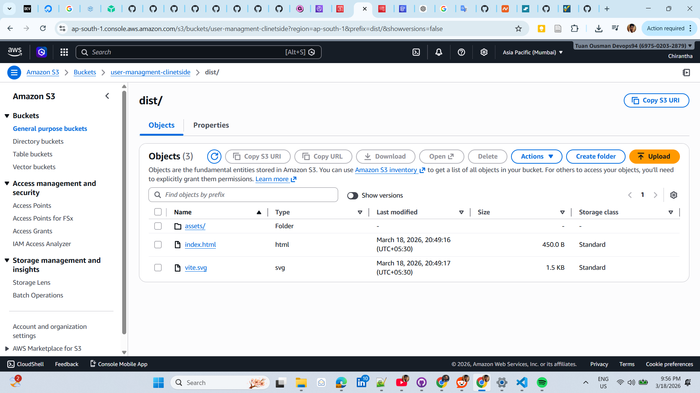

# AWS Serverless CRUD App

A production-grade, full-stack serverless application demonstrating complete CRUD operations using AWS Lambda, API Gateway, DynamoDB, Cognito authentication, CloudFront CDN, and a React frontend — deployed on a custom domain with HTTPS.



---

## Table of Contents

- [Architecture](#architecture)
- [Tech Stack](#tech-stack)
- [Project Structure](#project-structure)
- [1. DynamoDB Table Design](#1-dynamodb-table-design--creation)
- [2. IAM Roles & Policies](#2-iam-roles--policies)
- [3. Lambda CRUD Functions](#3-aws-lambda-crud-functions)
- [4. Lambda Layers](#4-aws-lambda-layers)
- [5. React Frontend](#5-react-frontend)
- [6. API Gateway + Cognito](#6-api-gateway--cognito-jwt-authorizer)
- [7. CloudFront Setup](#7-cloudfront-origins-behaviors--caching)
- [8. Custom Domain & HTTPS](#8-custom-domain--https-acm)
- [9. Local Development](#9-local-development)
- [10. Deployment](#10-deployment)
- [11. AWS Cleanup](#11-aws-resource-cleanup)
- [API Reference](#api-reference)

---

## Architecture

```
User Browser
     │
     ▼
┌─────────────────────────────┐
│  CloudFront CDN             │
│  (www.chiraops.online)      │
│                             │
│  /user*  ──────────────────►│──► API Gateway ──► Lambda ──► DynamoDB
│  /*      ──────────────────►│──► S3 Bucket (React App)
└─────────────────────────────┘
               │
               ▼
        AWS Cognito
     (JWT Authentication)
```

**Request Flow:**
1. User visits `https://www.chiraops.online`
2. CloudFront serves the React app from S3
3. User signs in via AWS Cognito Hosted UI
4. React app receives Cognito `id_token`
5. API calls go to `/user*` routes with Bearer token
6. CloudFront forwards `/user*` to API Gateway (preserving Authorization header)
7. API Gateway validates JWT via Cognito Authorizer
8. Lambda executes CRUD operation on DynamoDB

---

## Tech Stack

| Layer | Technology |
|-------|-----------|
| Frontend | React 19 + Vite 7 |
| Auth | AWS Cognito (OIDC) |
| CDN | AWS CloudFront |
| API | AWS API Gateway (HTTP API) |
| Compute | AWS Lambda (Node.js ESM) |
| Database | AWS DynamoDB |
| Storage | AWS S3 |
| SSL/TLS | AWS Certificate Manager (ACM) |
| DNS | Custom domain (Namecheap) |

---

## Project Structure

```
aws-serverless-crud-app/
├── Lambda_Functions/               # Standalone Lambda functions
│   ├── post/                       # CREATE user
│   │   ├── index.mjs
│   │   └── post.zip
│   ├── get/                        # READ user(s)
│   │   ├── index.mjs
│   │   └── get.zip
│   ├── update/                     # UPDATE user
│   │   ├── index.mjs
│   │   └── put.zip
│   └── delete/                     # DELETE user
│       ├── index.mjs
│       └── delete.zip
│
├── Layers/                         # Lambda Layer (shared dependencies)
│   ├── nodejs/
│   │   ├── utils.mjs               # Shared response helper
│   │   └── package.json            # AWS SDK v3 dependencies
│   ├── layer.zip                   # Packaged layer for upload
│   └── LambdaFunctionsWithLayer/   # Alternative: functions using layer
│
├── app/                            # React frontend
│   ├── src/
│   │   ├── main.jsx                # AuthProvider setup
│   │   ├── App.jsx                 # Main CRUD logic
│   │   ├── services/api.js         # API client
│   │   └── components/
│   │       ├── UserCard.jsx
│   │       └── UserForm.jsx
│   ├── .env                        # Environment variables
│   └── dist/                       # Production build (upload to S3)
│
└── images/                         # Architecture & setup screenshots
```

---

## 1. DynamoDB Table Design & Creation



### Table Configuration

| Setting | Value |
|---------|-------|
| Table Name | `Users` |
| Partition Key | `userId` (String) |
| Billing Mode | On-demand (Pay per request) |
| Region | `ap-south-1` (Mumbai) |

### Data Schema

```json
{
  "userId":    "string (UUID) — Partition Key",
  "email":     "string",
  "fullName":  "string",
  "status":    "string (active | inactive | pending)",
  "createdAt": "ISO 8601 timestamp",
  "updatedAt": "ISO 8601 timestamp"
}
```

### Steps to Create

1. Go to **AWS Console** → **DynamoDB** → **Create table**
2. Set **Table name**: `Users`
3. Set **Partition key**: `userId` (String)
4. Choose **On-demand** capacity mode
5. Click **Create table**

---

## 2. IAM Roles & Policies

Each Lambda function needs an execution role with DynamoDB access.

### Lambda Execution Role Policy

```json
{
  "Version": "2012-10-17",
  "Statement": [
    {
      "Effect": "Allow",
      "Action": [
        "dynamodb:PutItem",
        "dynamodb:GetItem",
        "dynamodb:UpdateItem",
        "dynamodb:DeleteItem",
        "dynamodb:Scan"
      ],
      "Resource": "arn:aws:dynamodb:ap-south-1:*:table/Users"
    },
    {
      "Effect": "Allow",
      "Action": [
        "logs:CreateLogGroup",
        "logs:CreateLogStream",
        "logs:PutLogEvents"
      ],
      "Resource": "*"
    }
  ]
}
```

### Steps to Create

1. Go to **IAM** → **Roles** → **Create role**
2. Select **AWS service** → **Lambda**
3. Attach policy: `AWSLambdaBasicExecutionRole`
4. Add inline policy with DynamoDB permissions above
5. Name the role: `lambda-dynamodb-role`

---

## 3. AWS Lambda CRUD Functions



### Function Overview

| Function | Handler | Method | Route |
|----------|---------|--------|-------|
| `createUser` | `index.createUser` | POST | `/user` |
| `getUser` | `index.getUser` | GET | `/user`, `/user/{id}` |
| `updateUser` | `index.updateUser` | PUT | `/user/{id}` |
| `deleteUser` | `index.deleteUser` | DELETE | `/user/{id}` |

### Runtime Configuration

- **Runtime**: Node.js 22.x
- **Architecture**: x86_64
- **Module type**: ES Modules (`.mjs`)
- **Timeout**: 10 seconds
- **Memory**: 128 MB

### CREATE — `Lambda_Functions/post/index.mjs`

```javascript
// POST /user — Creates a new user with duplicate prevention
export const createUser = async (event) => {
    const { userId, email, fullName, status } = JSON.parse(event.body);
    // Uses PutCommand with ConditionExpression to prevent duplicates
    // Returns 201 on success, 409 if userId already exists
};
```

### READ — `Lambda_Functions/get/index.mjs`

```javascript
// GET /user       → returns all users (Scan)
// GET /user/{id}  → returns single user (GetItem)
export const getUser = async (event) => {
    const userId = event.pathParameters?.id;
    // ScanCommand for all users, GetCommand for single user
};
```

### UPDATE — `Lambda_Functions/update/index.mjs`

```javascript
// PUT /user/{id} — Updates email, fullName, and/or status
export const updateUser = async (event) => {
    const { userId } = event.pathParameters;
    // Uses ExpressionAttributeNames to handle "status" reserved keyword
    // Returns 404 if user not found
};
```

### DELETE — `Lambda_Functions/delete/index.mjs`

```javascript
// DELETE /user/{id} — Deletes user, returns deleted data
export const deleteUser = async (event) => {
    const { userId } = event.pathParameters;
    // Uses ConditionExpression to confirm item exists before deleting
    // Returns 404 if user not found
};
```

### Deployment Steps

1. Go to **Lambda** → **Create function** → **Author from scratch**
2. Set **Runtime**: Node.js 22.x
3. Assign the IAM role: `lambda-dynamodb-role`
4. Upload the `.zip` from `Lambda_Functions/{function}/`
5. Set the correct handler (e.g., `index.createUser`)
6. Repeat for all 4 functions

---

## 4. AWS Lambda Layers

Lambda Layers share the AWS SDK and utilities across functions — keeping each deployment package small and clean.

### Layer Contents

```
Layers/nodejs/
├── package.json          # @aws-sdk/client-dynamodb, @aws-sdk/lib-dynamodb
└── utils.mjs             # Shared createResponse helper
```

### Shared Utility

```javascript
// Layers/nodejs/utils.mjs
const createResponse = (statusCode, body) => {
    return {
        statusCode,
        headers: { "Content-Type": "application/json" },
        body: JSON.stringify(body),
    };
};
export { createResponse };
```

### Create & Upload the Layer

```bash
cd Layers
zip -r layer.zip nodejs/
```

1. Go to **Lambda** → **Layers** → **Create layer**
2. Name: `nodejs-dependencies`
3. Upload `layer.zip`
4. Compatible runtime: **Node.js 22.x**
5. Click **Create**
6. Attach the layer ARN to each Lambda function

---

## 5. React Frontend

### Environment Variables

Create `app/.env`:

```env
VITE_API_URL="https://www.yourdomain.com"

# Cognito Configuration
VITE_COGNITO_AUTHORITY="https://cognito-idp.{region}.amazonaws.com/{userPoolId}"
VITE_COGNITO_CLIENT_ID="your-app-client-id"
VITE_COGNITO_REDIRECT_URI="https://www.yourdomain.com"
VITE_COGNITO_DOMAIN="https://{cognitoDomain}.auth.{region}.amazoncognito.com"
```

### Key Components

| Component | Purpose |
|-----------|---------|
| `main.jsx` | Wraps app with Cognito `AuthProvider` |
| `App.jsx` | Main CRUD logic, auth state, notifications |
| `UserCard.jsx` | Displays user with status badge and actions |
| `UserForm.jsx` | Create/Edit modal with validation |
| `services/api.js` | Centralized API client with Bearer token |

### Authentication Flow

```javascript
// main.jsx — Cognito OIDC configuration
const cognitoAuthConfig = {
    authority: import.meta.env.VITE_COGNITO_AUTHORITY,
    client_id: import.meta.env.VITE_COGNITO_CLIENT_ID,
    redirect_uri: import.meta.env.VITE_COGNITO_REDIRECT_URI,
    response_type: "code",
    scope: "email openid phone",
    onSigninCallback: () => {
        window.history.replaceState({}, document.title, window.location.pathname);
    },
};
```

> **Important:** Use `auth.user.id_token` (not `access_token`) as the Bearer token. API Gateway JWT authorizer validates the `aud` claim, which is only present in Cognito `id_token`.

---

## 6. API Gateway + Cognito JWT Authorizer



### HTTP API Configuration

| Setting | Value |
|---------|-------|
| API Type | HTTP API |
| Stage | `$default` (auto-deploy enabled) |
| CORS | Enabled |

### Routes

| Method | Route | Lambda | Auth |
|--------|-------|--------|------|
| GET | `/user` | `getUser` | JWT |
| GET | `/user/{id}` | `getUser` | JWT |
| POST | `/user` | `createUser` | JWT |
| PUT | `/user/{id}` | `updateUser` | JWT |
| DELETE | `/user/{id}` | `deleteUser` | JWT |

### Cognito JWT Authorizer Setup

1. Go to **API Gateway** → your API → **Authorization**
2. Click **Manage authorizers** → **Create**
3. Configure:
   - **Name**: `cognito-userManagement`
   - **Type**: JWT
   - **Identity source**: `$request.header.Authorization`
   - **Issuer URL**: `https://cognito-idp.{region}.amazonaws.com/{userPoolId}`
   - **Audience**: your Cognito App Client ID
4. Go to **Attach authorizers to routes** → attach to all routes

### Cognito User Pool Setup



1. Go to **Cognito** → **Create user pool**
2. Sign-in option: **Email**
3. Create **App client** → note the **Client ID**
4. Under **Hosted UI** configure:
   - **Allowed callback URLs**: `https://www.yourdomain.com`, `http://localhost:5173`
   - **Allowed sign-out URLs**: `https://www.yourdomain.com`, `http://localhost:5173`
   - **OAuth grant types**: Authorization code grant
   - **Scopes**: `email`, `openid`, `phone`

---

## 7. CloudFront Origins, Behaviors & Caching



CloudFront serves as both the CDN for the React app and a reverse proxy for the API — enabling a single domain for everything and eliminating CORS issues.

### Origins

| Origin | Type | Path |
|--------|------|------|
| S3 Bucket | S3 (OAC) | `/dist` |
| API Gateway | Custom (HTTPS) | — |

### Behaviors

| Path Pattern | Origin | Cache Policy | Origin Request Policy |
|-------------|--------|-------------|----------------------|
| `/user*` | API Gateway | CachingDisabled | AllViewerExceptHostHeader |
| `/*` (default) | S3 Bucket | CachingOptimized | — |

### Critical: Forward Authorization Header

For the `/user*` behavior, set **Origin request policy** to `AllViewerExceptHostHeader`.

> Without this, CloudFront strips the `Authorization` header and every API request returns **401 Unauthorized**.

### S3 Origin Access Control (OAC)

Keep the S3 bucket **private**. Allow access only from CloudFront:

```json
{
  "Version": "2008-10-17",
  "Statement": [{
    "Sid": "AllowCloudFrontServicePrincipal",
    "Effect": "Allow",
    "Principal": { "Service": "cloudfront.amazonaws.com" },
    "Action": "s3:GetObject",
    "Resource": "arn:aws:s3:::your-bucket-name/*",
    "Condition": {
      "ArnLike": {
        "AWS:SourceArn": "arn:aws:cloudfront::ACCOUNT_ID:distribution/DISTRIBUTION_ID"
      }
    }
  }]
}
```

### General Settings

- **Default root object**: `index.html`
- **Price class**: Use all edge locations (best performance)
- **Supported HTTP versions**: HTTP/2, HTTP/1.1, HTTP/1.0

---

## 8. Custom Domain & HTTPS (ACM)

### Request SSL Certificate

> ACM certificate must be created in **us-east-1** region for CloudFront.

1. Go to **ACM** (N. Virginia region) → **Request certificate**
2. Domain name: `www.yourdomain.com`
3. Validation method: **DNS validation**
4. Click **Request**

### Add DNS Validation Record

ACM provides a CNAME record for validation:

| Field | Value |
|-------|-------|
| Type | CNAME |
| Host | `_abc123.www` *(strip `.yourdomain.com` for Namecheap)* |
| Value | `_xyz.acm-validations.aws` |

> **Namecheap users:** The Host field must NOT include your domain name. Remove `.yourdomain.com.` from the end of the CNAME name provided by ACM.

### Attach Certificate to CloudFront

1. CloudFront distribution → **General** → **Edit**
2. Add **Alternate domain name**: `www.yourdomain.com`
3. Select the validated ACM certificate
4. Save changes

### DNS CNAME for Domain

Add to your DNS provider:

| Type | Host | Value | TTL |
|------|------|-------|-----|
| CNAME | `www` | `xxxxxxxxxxxx.cloudfront.net` | 30 min |

---

## 9. Local Development

### Prerequisites

- Node.js 18+
- AWS account with all resources provisioned

### Setup

```bash
git clone https://github.com/your-username/aws-serverless-crud-app.git
cd aws-serverless-crud-app

cd app
npm install
```

Configure `app/.env` with your AWS resource values (see [React Frontend](#5-react-frontend)).

Add `http://localhost:5173` to Cognito **Allowed callback URLs** and **Allowed sign-out URLs**.

```bash
npm run dev
# Visit http://localhost:5173
```

---

## 10. Deployment

### Step 1 — Deploy Lambda Functions

Upload each zip file to the corresponding Lambda function in AWS Console:

| Zip File | Lambda Function |
|----------|----------------|
| `Lambda_Functions/post/post.zip` | `createUser` |
| `Lambda_Functions/get/get.zip` | `getUser` |
| `Lambda_Functions/update/put.zip` | `updateUser` |
| `Lambda_Functions/delete/delete.zip` | `deleteUser` |

### Step 2 — Build React App

```bash
cd app
npm run build
```

### Step 3 — Upload to S3



Upload the **contents** of `app/dist/` to `s3://your-bucket/dist/`:

```
S3 structure:
your-bucket/
└── dist/
    ├── index.html
    ├── vite.svg
    └── assets/
        ├── index-[hash].js
        └── index-[hash].css
```

> Upload the **contents** of `dist/`, not the `dist/` folder itself.

### Step 4 — Invalidate CloudFront Cache

1. Go to **CloudFront** → your distribution → **Invalidations**
2. Click **Create invalidation**
3. Object path: `/*`
4. Click **Create**

---

## 11. AWS Resource Cleanup

> Delete these resources when no longer needed to avoid charges.

### Cleanup Order

| Step | Service | Action |
|------|---------|--------|
| 1 | CloudFront | Disable distribution → wait ~15 min → Delete |
| 2 | ACM | Delete certificate |
| 3 | API Gateway | Delete API |
| 4 | Lambda | Delete all 4 functions |
| 5 | Lambda Layers | Delete layer versions |
| 6 | Cognito | Delete User Pool |
| 7 | DynamoDB | Delete `Users` table |
| 8 | S3 | Empty bucket → Delete bucket |
| 9 | IAM | Delete `lambda-dynamodb-role` |

> CloudFront must be **disabled first** before it can be deleted.

---

## API Reference

**Base URL:** `https://www.chiraops.online`

All endpoints require:
```
Authorization: Bearer <cognito-id-token>
Content-Type: application/json
```

### Endpoints

| Method | Endpoint | Description |
|--------|----------|-------------|
| GET | `/user` | Get all users |
| GET | `/user/{userId}` | Get user by ID |
| POST | `/user` | Create new user |
| PUT | `/user/{userId}` | Update user |
| DELETE | `/user/{userId}` | Delete user |

### Create User — Request Body

```json
{
  "userId": "user-123",
  "email": "john@example.com",
  "fullName": "John Doe",
  "status": "active"
}
```

### Response Codes

| Code | Meaning |
|------|---------|
| 200 | Success |
| 201 | User created |
| 400 | Missing required fields |
| 401 | Unauthorized (invalid/missing token) |
| 404 | User not found |
| 409 | User already exists |
| 500 | Internal server error |

---

## License

MIT

---

> Built with AWS Lambda, API Gateway, DynamoDB, Cognito, CloudFront, S3, and React.
